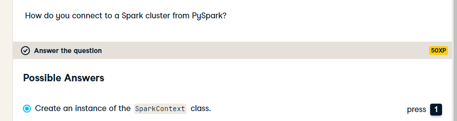
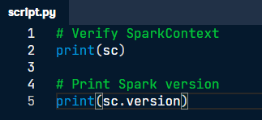
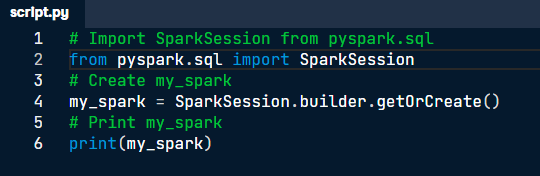
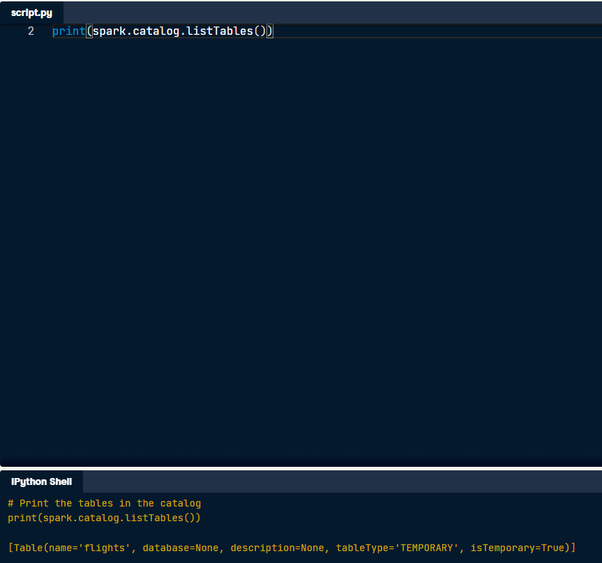

# PYSPARK

Creating a connection is as simple as creating an instance of the class: **_SparkContext()_**. This is a class constructor that takes few arguments that can be created with the constructor: **_SparkConf()_**.
The **_SparkContext_** usually will be called **sc**.

Is with **_SparkContext_** class that you connect with the cluster of **Spark**.
The **_SparkContext_** can be verified by printing sc, also the version of **Spark** running in the cluster.

To get started, a **_SparkSession_** object from the **_SparkContext_** must be created. "You can think of the **_SparkContext_** as your **connection** to the **cluster** and the **_SparkSession_** as your **interface** with that **connection**".
Usually, the **_SparkSession_** is called **spark**.

Spark's core data structure is the **_Resilient Distributed Dataset (RDD)_**.
Spark also have other data structures as Spark's **_DataFrame_** designed to behave similar to a **SQL table**.

## CREATING A SPARK SESSION.

**Note:** Creating multiple **SparkSession**s and **SparkContext**s can cause issues.
Is a best practice to use the method: **_SparkSession.builder.getOrCreate()_**, which returns an existing **SparkSession** if there's already one in the enviroment. or creates a new one if necessary.

Once the **SparkSession** is created, the data inside the cluster can be listed with the attribute **_catalog_**. With the method **_.listTables()_** a list of all the tables names inside the cluster will be called.

